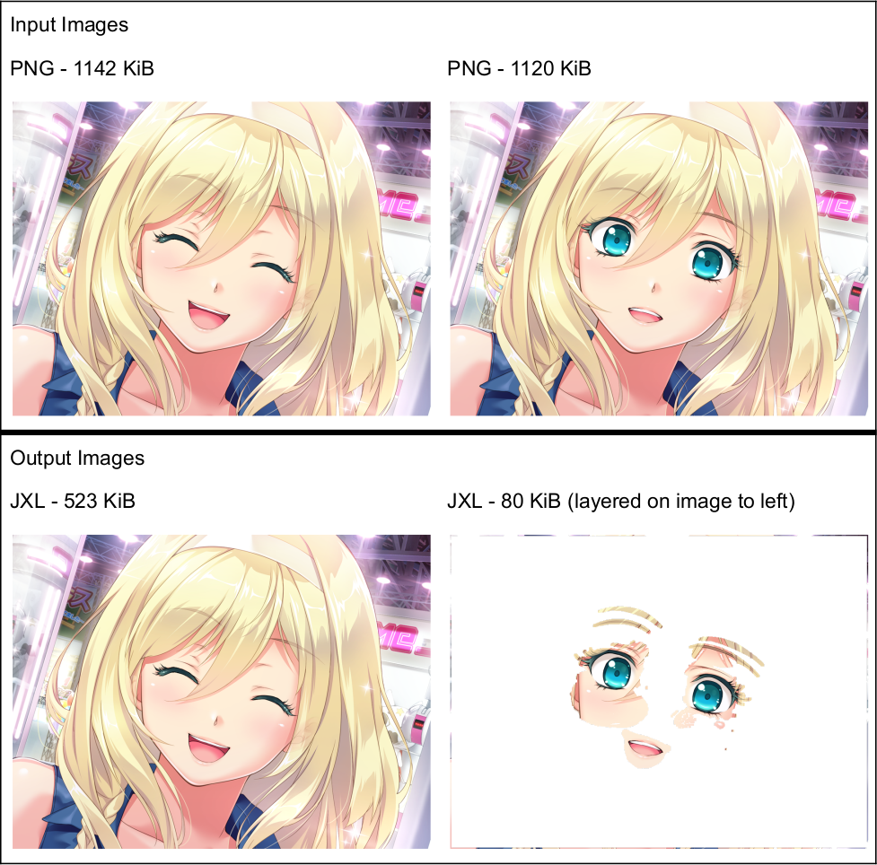

### Introduction

Manjaxl (mon-jocks-ul) is a compression tool for image archives, especially those with repetitive images. It uses JPEG XL and _deltas_ for efficient compression. Delta images are transparent and contain only the changes from a base image, enabling far smaller compressed archives when many images are similar.



Manjaxl defaults to lossless compression for lossless inputs (PNG, BMP, TIFF), and visually lossless compression (quality 90 / distance 1) for lossy images (JPEG).

On a 718 GiB HCG test corpus, output archives are **6.8x** smaller on average (geomean). Lossy archives average **7.2x** smaller and lossless archives average **5.3x** smaller.

### Viewing

No viewers are known that officially support this format currently. Support is very simple to add:

- ensure that JPEG XL images work in your viewer. This can sometimes be achieved through lower-level integrations, like libjxl's GDK library.
- if a `.jxl` file has `_ON_` in its filename, build the output image by layering the specificed images together. On error, simply return the base image. For example, `a_ON_b_ON_c.jxl` requires loading three images, `a_ON_b_ON_c.jxl` `b_ON_c.jxl` `c.jxl` and compositing them on top of each other, respecting their alpha channels. Up to 5 images may be layered.

For [mcomix](https://sourceforge.net/p/mcomix/git/ci/master/tree/), the patch looks like:

```diff
diff --git a/mcomix/mcomix/image_tools.py b/mcomix/mcomix/image_tools.py
index 6a2eeba..42d7006 100644
--- a/mcomix/mcomix/image_tools.py
+++ b/mcomix/mcomix/image_tools.py
@@ -438,6 +438,19 @@ def load_pixbuf(path):
                 return pil_to_pixbuf(im, keep_orientation=True)
     except:
         pass
+    try:
+        if path.endswith('.jxl') and '_ON_' in path:
+            delta = GdkPixbuf.Pixbuf.new_from_file(path)
+            index = 0
+            basename = os.path.basename(path)
+            while (index := basename.find('_ON_', index) + 4) >= 4:
+                basepath = os.path.join(os.path.dirname(path), basename[index:])
+                base = GdkPixbuf.Pixbuf.new_from_file(basepath)
+                delta.composite(base, dest_x=0, dest_y=0, dest_width=base.get_width(), dest_height=base.get_height(), offset_x=0, offset_y=0, scale_x=1, scale_y=1, interp_type=0, overall_alpha=255)
+                delta = base
+            return base
+    except:
+        pass
     if not enable_anime:
         return GdkPixbuf.Pixbuf.new_from_file(path)
     if (pixbuf:=GdkPixbuf.PixbufAnimation.new_from_file(path)).is_static_image():
```

### Using

Currently, only Linux is supported. The encoder relies on JPEG XL libraries from [the libjxl releases](https://github.com/libjxl/libjxl/releases) to be installed first.

Then, do `pip install -r requirements.txt`.

Finally, `python main.py [input.zip] [output.zip]`
